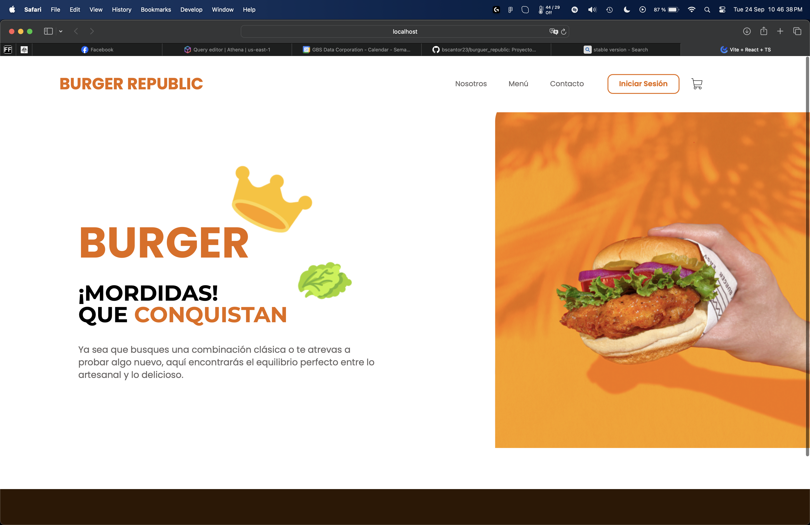
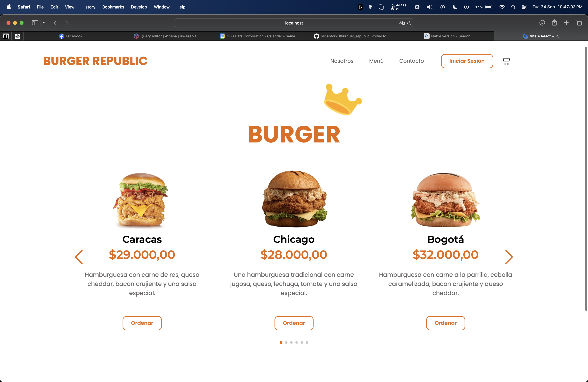
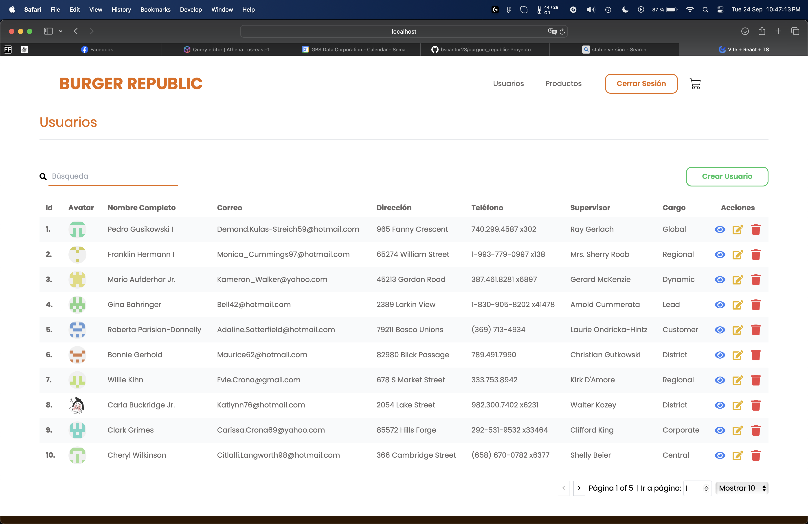

# How to Run the Project

To run the project, make sure you have Node.js installed on your computer, then follow these steps:

1. **Clone the repository**:
    ```bash
    git clone https://github.com/bscantor23/burguer_republic.git
    ```

2. **Navigate to the project directory**:
    ```bash
    cd burguer_republic
    ```

3. **Install dependencies**:
    ```bash
    npm install
    ```

4. **Start the development server**:
    ```bash
    npm run dev
    ```

5. **Open you browser** and go to `http://localhost:5173/` to see the application running.

That’s it! You should now be able to view the project built with React, Vite, and Tailwind CSS.







**Nota:** The prototype is currently fully responsive.
